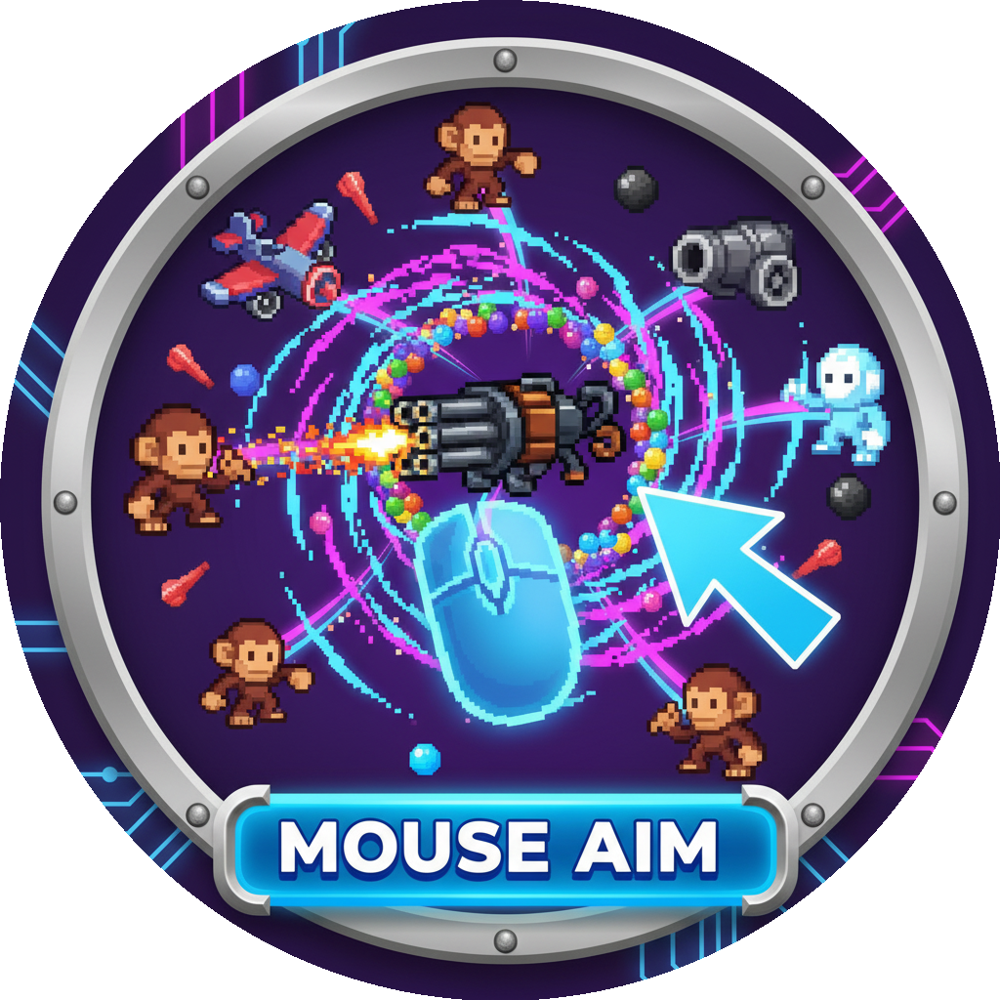

<h1 align="center">

</h1>
<h3 align="center">Makes all towers and paragons shoot with mouse control like the Dartling Gunner.</h3>
<h1 align="center">All Dartling</h1>

Excluded Towers (work normally):

- ✅ Mortar
- ✅ Spike Factory
- ✅ Alchemist
- ✅ Banana Farm

All other towers work as intended. To try :
- Tackshooter-500 with bloons on screen
- All rifled based monkeys (Sniper, Desperado etc...)

Have fun !
